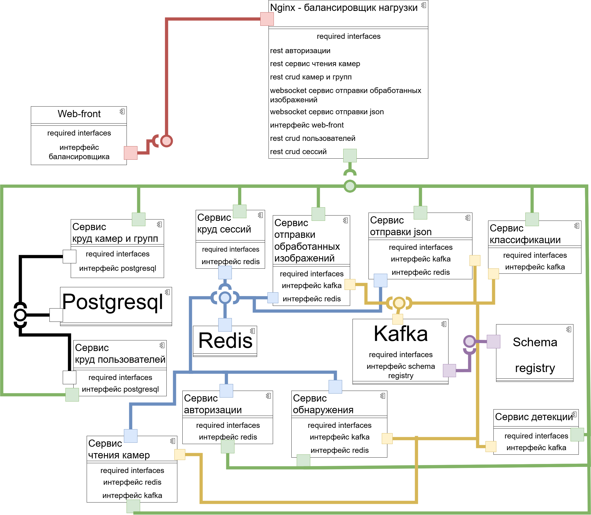
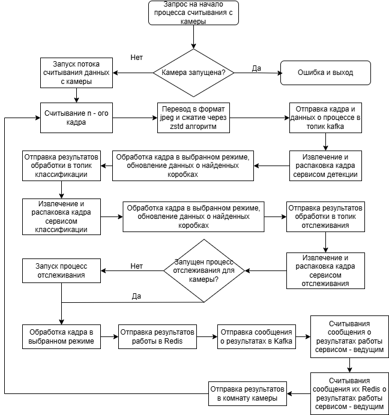
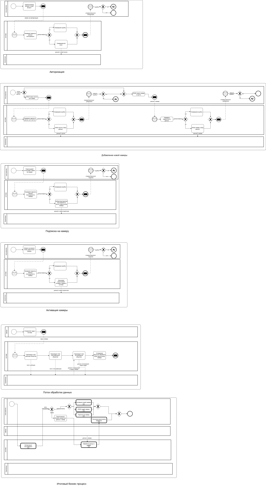
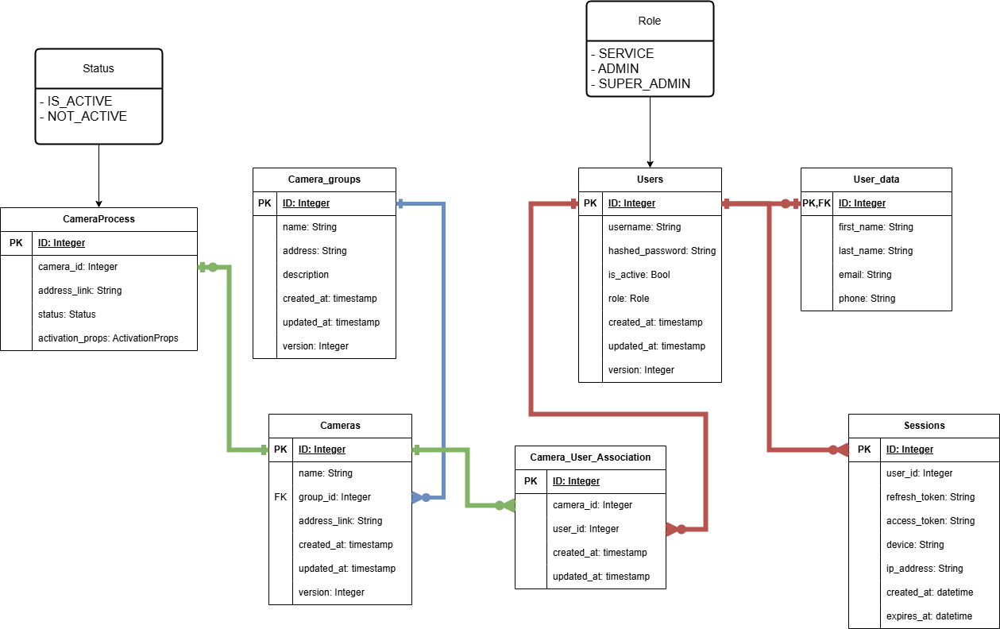

# 🛒 WeWatch: Система отслеживания магазинных тележек

## 📌 Описание

**WeWatch** — микросервисная система для автоматического обнаружения, классификации и отслеживания магазинных тележек в реальном времени. Система основана на модели **YOLOv8x** для детекции объектов, кастомном классификаторе на базе **ResNet-18** и алгоритме **DeepSORT** для трекинга. Обмен сообщениями реализован через Kafka, состояние и авторизация — через Redis.

---

## 📐 Диаграммы

### 🧩 **Диаграмма компонентов**  
Архитектура микросервисов (детекция, классификация, трекинг, API, WebSocket, Kafka, Redis)

  

### 🔁 **Основной цикл обработки**  
Последовательность обработки от камеры до UI

  

### 🧰 **Use Case диаграмма**  
Пользовательский сценарий: просмотр тележек, активация камеры

  

### 🔄 **BPMN**  
Бизнес-процесс обработки кадра (камера → Kafka → обработка → Web)

  

### 🗃️ **ER-диаграмма базы данных**  
Связи между таблицами: пользователи, камеры, группы, сессии, треки

  

---

## ⚙️ Архитектура

**Основные компоненты:**

- **YOLOv8x**: Обнаружение тележек
- **ResNet18 (2-канальный)**: Классификация тележек (например, "Магнит", "похожая", "другая")
- **DeepSORT**: Отслеживание тележек по их перемещениям
- **Kafka**: Очереди сообщений для обработки изображений
- **Redis**: Хранение треков, очередей, авторизации
- **FastAPI**: HTTP и WebSocket-интерфейс
- **Socket.IO**: Визуализация отслеживания в реальном времени
- **Zstandard**: Сжатие изображений

---

## 🧪 Метрики

### 🔍 Обнаружение

| Модель          | Precision | Recall | F1-Score | mAP50 | mAP50-95 |
|----------------|----------------|-----------------|------------|------------|------------|
| Yolo8x | 93.9% | 87.3% | 90.5%  | 0.937 | 0.795 |

### 🔍 Классификация

| Модель          | Top-1 Accuracy | Validation Loss | Train Loss |
|----------------|----------------|-----------------|------------|
| ResNet-18 | 93.9%         | 0.15–0.28       | 0.07–0.27  |

### 🎯 Трекинг (DeepSORT)

- **MOTA (Multiple Object Tracking Accuracy)** ≈ 70%
- **MOTP (Precision)** ≈ 79%
- **ID Switches**: ≤ 5% от общего числа треков

---

---

## 📂 Datasets

### 🛒 [Shopping Trolley Detection (YOLOv8)](https://app.roboflow.com/kirill-kornilov-kn3yx/shopping-trolley-kn5tj/26)
Набор данных для **обнаружения тележек**. Используется для обучения модели YOLOv8, отвечающей за локализацию объектов на кадрах с камер видеонаблюдения.  
Содержит аннотированные изображения с bounding box разметкой тележек. Данные прошли предобработку, включая аугментации и балансировку классов.

- 📸 Тип задачи: Object Detection  
- 📦 Формат аннотаций: YOLO  
- 🧪 Использование: модель `yolov8x` в компоненте детекции  

---

### 🧠 [Trolleys Classification](https://app.roboflow.com/kirill-kornilov-kn3yx/trolleysclassification/5)
Набор данных для **классификации типов тележек**, применяемый после детекции для уточнения принадлежности к определённой категории.  
Классификатор использует архитектуру `ResNet-18` (в двух вариантах: с 6 каналами и с двумя параллельными ветками) и работает по изображению тележки, вырезанному на этапе детекции.

- 🔍 Тип задачи: Image Classification  
- 🏷️ Классы:  
  1. Магнитовская тележка (с фирменными красными элементами)  
  2. Неуверенная тележка (похожие признаки, но нет полной уверенности)  
  3. Прочее (все ложные срабатывания и другие объекты)  
- 📦 Формат аннотаций: классификационные метки  
- 🧪 Использование: в post-processing блоке до трекинга DeepSORT

---

